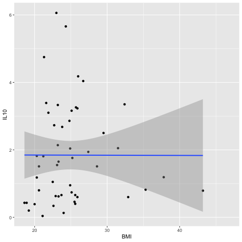
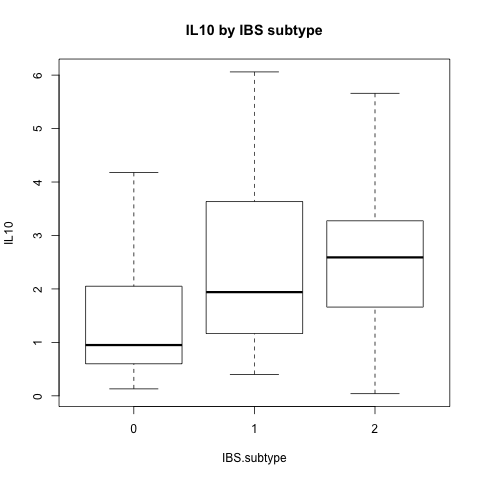

 BTEC330 F2019 Project2 Loic soumani
## AnalyzeIL10 by Loic Soumani

### Single and multiple regressions, and scatterplots for clinical IL10 and gene expression data.
([AnalyzeIL10.R](../master/AnalyzeIL10.R)) will allow you to load a comma-delimited .csv with various datapoints, perform single and multiple regressions of Body Mass Index (BMI) vs. variables from the Complete Blood Count with Differential (CBC-D) results, and produce 2-D and 3-D scatterplots for the results. 

## IL10 parameter:
 Interleukin-10 (encoded by IL10) is an important regulatory cytokine with both immunosuppressive and immunostimulatory properties. It can inhibit the functions of T cells and antigen presenting cells (APCs) but promotes B cell–mediated functions, enhancing survival, proliferation, differentiation, and antibody production.It is a key anti-inflammatory cytokine that can inhibit proinflammatory responses of both innate and adaptive immune cells which means impeding pathogen clearance and ameliorating immunopathology.
  ### Kapsenberg, M. L.. 2003. Dendritic-cell control of pathogen-driven T-cell polarization. Nat. Rev. Immunol. 3: 984-993 
  ### /https://www.sciencedirect.com/topics/neuroscience/interleukin-10 
  
 ## Install necessary packages
install.packages("ggplot2")
library(ggplot2)

## Read data
IBS <- read.csv("data/RobinsonEtAl_Sup1.csv", header = TRUE)
head(IBS)
write.csv(IBS, "data_output/IL10.csv")
##  Single Regressions 
##  Data obtained from Robinson, et al. 2019 (doi: https://doi.org/10.1101/608208)
##  https://statquest.org/2017/10/30/statquest-multiple-regression-in-r/
##  http://www.sthda.com/english/articles/40-regression-analysis/167-simple-linear-regression-in-r/
##  http://r-statistics.co/Linear-Regression.html

## Single Regression Test, BMI vs. IL10 parameter
IL10.regression <- lm(BMI ~ IL10, data = IBS)
summary(IL10.regression)
## Output the results to a file
## http://www.cookbook-r.com/Data_input_and_output/Writing_text_and_output_from_analyses_to_a_file/
sink('data_output/IL10_regression.txt', append = TRUE)
print(IL10.regression)
sink()

## ANOVA: IBS-subtype vs. IL10 parameter

## http://www.sthda.com/english/wiki/one-way-anova-test-in-r
IL10.aov <- aov(IL10 ~ IBS.subtype, data = IBS)
summary(IL10.aov)
sink('data_output/IL10_anova.txt', append = TRUE)
print(IL10.aov)
sink()
## Print scatterplot and box plots as .png files into "fig_output" project directory.
## http://www.sthda.com/english/wiki/ggsave-save-a-ggplot-r-software-and-data-visualization

## Scatterplots

## https://www.statmethods.net/graphs/scatterplot.html

ggplot(IBS, aes(x = BMI, y = IL10)) +
  geom_point() +    
  geom_smooth(method = lm) 

png("fig_output/IL10_scatterplot.png")
IL10_scatterplot <- ggplot(IBS, aes(x = BMI, y = IL10)) +
  geom_point() +    
  geom_smooth(method = lm) 

print(IL10_scatterplot)
dev.off()

## Box plots
## https://www.statmethods.net/graphs/boxplot.html

boxplot(IL10 ~ IBS.subtype, data = IBS, main="IL10 by IBS subtype", 
        xlab = "IBS.subtype", ylab = "IL10"
)

png("fig_output/IL10_boxplot.png")
IL10_boxplot <- boxplot(IL10 ~ IBS.subtype, data = IBS, main="IL10 by IBS subtype", 
                       xlab = "IBS.subtype", ylab = "IL10"
)
print(IL10_boxplot)
dev.off()

IBS$IL10_result <- "NA"

## Assign "HIGH", "NORMAL", or "LOW" based on clinical range to the LDH_result parameter

IBS$IL10_result[IBS$IL10 > 4] <- "HIGH"

IBS$IL10_result[IBS$IL10 <= 4 & IBS$IL10 >= 0.25] <- "NORMAL"

IBS$IL10_result[IBS$IL10 < 0.25] <- "LOW"

write.csv(IBS, "data_output/IL10_result.csv")

### Results of single regression, BMI x IL10 scatterplot

> single.regression <- lm(BMI ~ IL10, data=IBS1)
> print(single.regression)

Call:
lm(formula = BMI ~ IL10, data = IBS1)

Coefficients:
  (Intercept)         IL10  
      31.9454        -0.5004  


ggplot(IBS1, aes(x=BMI, y=IL10)) +
  geom_point() +    
  geom_smooth(method=lm) 
  



## RESULT OF SINGLE REGRESSION BMI, IL10 BOXPLOT FROM ANOVA

ggplot(IBS, aes(x = BMI, y = IL10)) + geom_point() + geom_smooth(method = lm) 
> png("fig_output/IL10_boxplot.png")
> Lymphocytes_boxplot <- ggplot(IBS, aes(x = BMI, y = IL10)) + geom_point() + geom_smooth(method = lm) 
> print(IL10_boxplot)

Call:
lm(formula = BMI ~ IL10, data = IBS1 )

Coefficients:
(Intercept)         IL10 
     31.9454        -0.5004
     


##
##

# <p align = "center"> BTEC395 PROJECT
# <p align = "center"> Data Transformation and Volcano Plots
  
  
  ### Discription About the project
 
  (BTEC395-IL10finalproject.R) IS a project that permits to load a comma-delimited .csv with various datapoints, perform single regressions and anova of each gene expressed in the .csv file vs. IL10 gene.
   
   The project further  allows to perform a recursive analysis for regression which creates a date frame list to store all the genes necessary for the analysis. Transformations such as log2 FC and -log10 will be combined and exported to create a volcanoplot which computes the signfiance of each gene and relevance to the analysis being performed.
   
   <p style="text-indent: 160px"> The lines of codes used in this analysis were downloaded from:   
https://stackoverflow.com/questions/42464767/how-to-run-lm-regression-for-every-column-in-r.
https://stackoverflow.com/questions/44170937/performing-lm-and-segmented-on-multiple-columns-in-r.
http://www.learnbymarketing.com/tutorials/explaining-the-lm-summary-in-r/.
https://tutorials.iq.harvard.edu/R/Rstatistics/Rstatistics.html.


## Recursive analysis for regression  - RNA Expression ##
### Access only the columns with RNA Expression
```
> names(IBS1)[37:286]
```
### Make a data frame of list type
```
> storage <- list()
```

### linear regression for each expressed gene vs parameter 
```
for(i in names(IBS1)[37:286]){
 > storage[[i]]  <- lm(get(i) ~ IL10 , IBS1)
}
```
### Make a list of anova(lm()) results for parameter
```
> storage3 <- list()

for(i in names(IBS)[28:277]){
> storage3[[i]]  <- anova(lm(get(i) ~ IL10, IBS))
}
 ```

### IL10 volcanoplot 

 
 
 ### Gene Significance for IL10
 
  | Gene | Name|
  |------|-----|
  | ETV3 | ETS Variant Transcription Factor 3|
  
 
 
 ###           Gene Ontology: Concept
 Gene Ontology is a major bioinformatics initiative to unify the representation of gene and gene product attributes across all species
 
 The following analysis can be performed on the website: http://www.pantherdb.org/tools/compareToRefList.jsp
 
 
 #### Gene Ontology of IL10 gene
 This analysis is going to compute all the significant genes in IL10 count observed in the VolcanoPlot. 
 
 + ETV3 is a Transcriptional repressor that contribute to growth arrest during terminal macrophage differentiation by repressing target genes involved in Ras-dependent proliferation. It is located on 1q23.1. The ETV3 gene is conserved in chimpanzee, dog, cow, mouse, rat, chicken, and frog. 113 organisms have orthologs with human gene ETV3.

